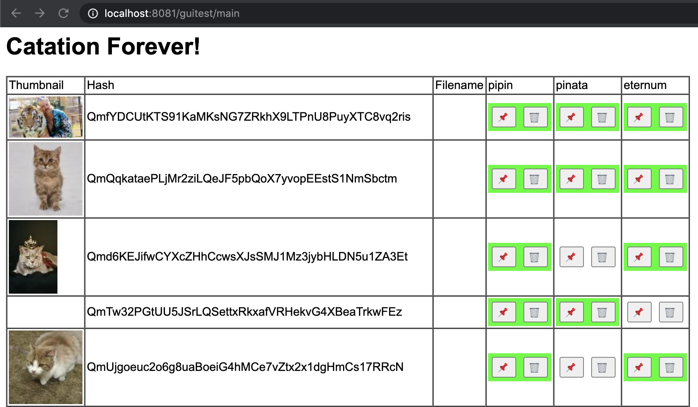

⚠️ **NOTE TO WPENGINE EMPLOYEES: THIS PROJECT IS NOT YET OFFICIALLY CONFIRMED FOR GPLv3 OPEN SOURCE RELEASE - ALL THE INFO ABOUT IT IS PRELIMINARY PENDING CONFIRMATION** ⚠️

# Catation & Catation Forever - experiments in IPFS photo sharing

**Catation** is an experimental app for easy sharing of photo albums with non-tech people, using IPFS.
The pitch tagline is **"Dropbox for IPFS"**, or:
"Easily share your cat & vacation photos with your family & friends!"
(\* dog photos are encouraged as well)

**Catation Forever: Herder** is an experimental app complementing **Catation**.
It provides a way to easily replicate (copy) or move your photos between
various IPFS pinning (i.e. data persistence) services.

⚠️⚠️⚠️⚠️⚠️⚠️⚠️

**⚠️⚠️⚠️ IMPORTANT NOTE: ⚠️⚠️⚠️** Catation & Catation Forever are one-off experiments built over a hackathon at WPEngine,
with explicitly **no official plans for maintenance or support from WPEngine**.
The projects are released for free under GPLv3+ as an act of gratitude towards the FLOSS community.
You are more than welcome to fork it & develop further on your own,
as long as you adhere to the GPLv3+ license terms.
The projects **are quick & dirty prototypes**,
thus they may and does use various **horrible & amazing shortcuts**
and are certainly **not ready for production-like use**. ⚠️⚠️⚠️

⚠️⚠️⚠️⚠️⚠️⚠️⚠️

## Running Catation

 1. Go to https://pinata.cloud, create an account and copy your new "API key" and "Secret API key" into environment variables:

        $ export PINATA_API_KEY=...
        $ export PINATA_SECRET_API_KEY=...

 2. Go to https://bit.ly, create an account and copy your new "API key" into an environment variable:

        $ export BITLY_API_KEY=...

 3. Start Catation GUI or CLI:

        $ go run ./cmd/gui   # alternative: GUI
        or:
        $ go run ./cmd/uploader image1.jpg image2.png   # alternative: CLI

 4. Scroll down and select checkboxes for the photos you want to share.
 5. Click **[Upload]** button.
 6. Observe the terminal window, and wait till a bit.ly URL shows up:

        2020/11/18 11:02:23 index.html --> /ipfs/QmXp2vE9rzPnUGucfB7zZ7pfa9uPYNjMTstmcuiFPBoYhz
        2020/11/18 11:02:23 Pinning /ipfs/QmXp2vE9rzPnUGucfB7zZ7pfa9uPYNjMTstmcuiFPBoYhz containing "index.html"
        2020/11/18 11:02:32 pinned 1/2: images/cat-2.jpg
        2020/11/18 11:02:36 pinned 2/2: images/cat-1.jpg
        2020/11/18 11:02:40 UPLOAD SUCCESSFUL! ---> /ipfs/QmXp2vE9rzPnUGucfB7zZ7pfa9uPYNjMTstmcuiFPBoYhz
        2020/11/18 11:02:40 Waiting for remaining images...

        >>>>>
        >>>>>     https://bit.ly/2K8R2Bd
        >>>>>

 7. Copy this link and share the album with your friends and family!

## Running Catation Forever: Herder

 1. Run herder.
    On first try, you will be prompted to create a config file -
    save below template into `config.json` and fill in the blanks. For example,
    fill Pinata account settings, and delete Pipin and Eternum configs:

        $ go run ./cmd/herder
        error: cannot read config.json: open config.json: no such file or directory
        HINT: example config.json (not all entries are required!):
        {
          "Pinata": {
            "Key": "",
            "Secret": ""
          },
          "Pipin": {
            "UseTLS": false,
            "Host": "",
            "Token": ""
          },
          "Eternum": {
            "Key": ""
          }
        }

 2. Run herder again, after filling `config.json`:

        $ go run ./cmd/herder
        2020/11/23 09:34:04 Starting GUI server on: http://localhost:8081/guitest/

    Your browser should now open and show the Catation Forever GUI.

 3. Optionally, if you have access to a Raspberry Pi or a VPS, and wish to use
    them to store a copy of your photos, see `./cmd/pipin/`. The Pipin project
    is a service you need to run on the server, and pass its secret token into
    Herder's `config.json`.
