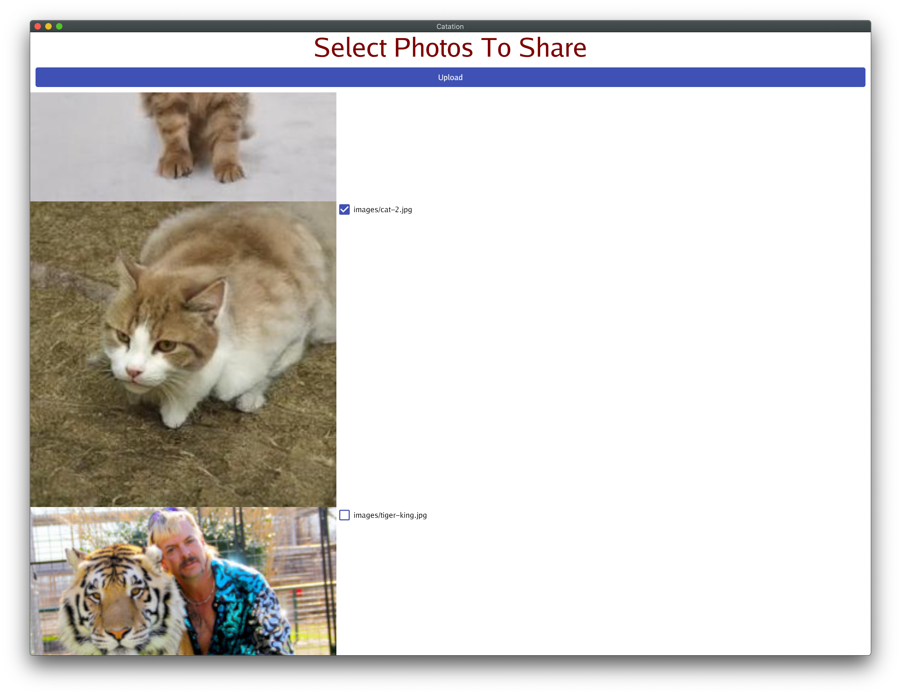

# Catation - an experiment in IPFS photo sharing

**Catation** is an experimental app for easy sharing of photo albums with non-tech people, using IPFS.
The pitch tagline is **"Dropbox for IPFS"**, or:
"Easily share your cat & vacation photos with your family & friends!"
(\* dog photos are encouraged as well)

⚠️⚠️⚠️⚠️⚠️⚠️⚠️

**⚠️⚠️⚠️ IMPORTANT NOTE: ⚠️⚠️⚠️** Catation is a one-off experiment built over a hackathon at WPEngine,
with explicitly **no official plans for maintenance or support from WPEngine**.
The project is released for free under GPL as an act of gratitude towards the FLOSS community.
You are more than welcome to fork it & develop further on your own,
as long as you adhere to the GPL license terms.
The project **is a quick & dirty prototype**,
thus it may and does use various **horrible & amazing shortcuts**
and is certainly **not ready for production-like use**. ⚠️⚠️⚠️

⚠️⚠️⚠️⚠️⚠️⚠️⚠️

## Running

 1. Go to https://pinata.cloud, create an account and copy your new "API key" and "Secret API key" into environment variables:

        $ export PINATA_API_KEY=...
        $ export PINATA_SECRET_API_KEY=...

 2. Go to https://bit.ly, create an account and copy your new "API key" into an environment variable:

        $ export BITLY_API_KEY=...

 3. Start Catation GUI:

        $ go run ./cmd/gui

 4. Scroll down and select checkboxes for the photos you want to share.
 5. Click **[Upload]** button.
 6. Observe the terminal window, and wait till a bit.ly URL shows up:

        2020/11/18 11:02:23 index.html --> /ipfs/QmXp2vE9rzPnUGucfB7zZ7pfa9uPYNjMTstmcuiFPBoYhz
        2020/11/18 11:02:23 Pinning /ipfs/QmXp2vE9rzPnUGucfB7zZ7pfa9uPYNjMTstmcuiFPBoYhz containing "index.html"
        2020/11/18 11:02:32 pinned 1/2: images/cat-2.jpg
        2020/11/18 11:02:36 pinned 2/2: images/cat-1.jpg
        2020/11/18 11:02:40 UPLOAD SUCCESSFUL! ---> /ipfs/QmXp2vE9rzPnUGucfB7zZ7pfa9uPYNjMTstmcuiFPBoYhz
        2020/11/18 11:02:40 Waiting for remaining images...
        
        
        >>>>>
        >>>>>     https://bit.ly/2K8R2Bd
        >>>>>

 7. Copy this link and share the album with your friends and family!

## Internal architecture details

The main technical idea & workflow of the app is:
 1. You pick a set of photos using a (cross-platform) GUI interface ([`./cmd/gui`](./cmd/gui))
    - The gui app wraps all the following steps, you don't need to run them manually - they're listed just to explain the architecture & data flow.
 2. The app creates a simple HTML "album" of the images ([`./cmd/builder`](./cmd/builder))
 3. The photos & the album are uploaded to local in-memory IPFS node ([`./cmd/uploader`](./cmd/uploader))
 4. The photos & the album are pinned using a freemium Pinata service ([`./cmd/pinner`](./cmd/pinner))
    - This makes the photos available for download even when you close your computer/laptop.
    - **NOTE:** This currently requires passing a Pinata token through environment variables: `PINATA_API_KEY` and `PINATA_SECRET_API_KEY`
    - TODO: Also support pinning using a Raspberry Pi you own, and/or pinning services other than Pinata.
    - TODO: Allow setting the tokens via GUI & somehow make it easier & more user-friendly
    - TODO: Give the user some way of deleting old photos from the pinning service?
 5. A link to the album at the public IPFS gateway is shortened using a free URL-shortening service bit.ly ([`./cmd/shortener`](./cmd/shortener))
    - This results in a short, publicly browsable link to the album, for easy sharing with non-techie friends & family, e.g. over a text message.
    - **NOTE:** This currently requires passing a bit.ly token through environment variable: `BITLY_API_KEY`
    - TODO: Also support pinning using URL-shortening services other than bit.ly.
    - TODO: Allow setting the token via GUI & somehow make it easier & more user-friendly

The result of this process is a short URL, that you can easily share with your friends & family, to give them access to selected photos.
The use of the pinning service provides a way to keep the album browsable even when you close the computer from which you uploaded the photos.

Final note: Please have fun with it, hopefully at least as much as we had when creating it! :)

